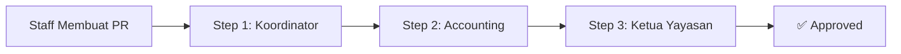
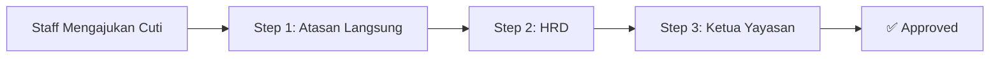
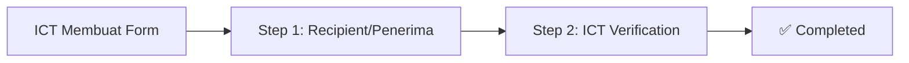

# 📋 Aturan Approval ISO Digital System
**Status: TEST MODE AKTIF ✅**

> [!WARNING]
> **Test Mode sedang aktif!** Semua email approval akan dikirim ke: **aris.setyawan@edelweiss.sch.id**
> 
> Untuk disable test mode, ubah `APPROVAL_TEST_MODE=false` di file `.env`

---

## 🔧 Konfigurasi Test Mode

```env
APPROVAL_TEST_MODE=true
APPROVAL_TEST_EMAIL=aris.setyawan@edelweiss.sch.id
```

Dalam **test mode**:
- ✉️ Semua email notifikasi dialihkan ke test email
- 🧪 Cocok untuk development dan testing
- 🔒 Tidak ada email yang terkirim ke user sebenarnya

---

## 📝 Form dan Alur Approval

### 1️⃣ Purchase Requisition (PR)

**Urutan Approval:**



**Detail Approval Steps:**

| Step | Role | Deskripsi |
|------|------|-----------|
| **1** | Koordinator Departemen | Koordinator dari departemen pembuat PR harus approve terlebih dahulu |
| **2** | Accounting | Tim Accounting memeriksa dan approve permintaan pembelian |
| **3** | Ketua Yayasan | Approval final dari Ketua Yayasan |

**Approver Configuration:**

- **Koordinator**: Ditentukan berdasarkan departemen pembuat PR
  - KB/TK: Armitridesi Shinta Marito
  - SD: Miske Ferlani
  - SMP: Yudha Hadi Purnama
  - PKBM: Mia Roosmalisa
  - ICT: Juarsa Oemardikarta
  - HRD: Juarsa Oemardikarta
  - Finance & Accounting: Juarsa Oemardikarta
  - Marketing: Juarsa Oemardikarta
  - Management: Ayu Puspitawati
  - Operator: Juarsa Oemardikarta
  - Customer Service Officer: Juarsa Oemardikarta

- **Accounting**: Titis Rahmawati Wijiastuti (titis.wijiastuti@edelweiss.sch.id)

- **Ketua Yayasan**: Juarsa Oemardikarta (juarsa.oemardikarta@edelweiss.sch.id)

---

### 2️⃣ Leave Request (Cuti/Izin)

**Urutan Approval:**



**Detail Approval Steps:**

| Step | Role | Deskripsi |
|------|------|-----------|
| **1** | Atasan Langsung | Koordinator departemen sebagai atasan langsung approve |
| **2** | HRD | Tim HRD memeriksa eligibility dan approve |
| **3** | Ketua Yayasan | Approval final dari Ketua Yayasan |

**Approver Configuration:**

- **Atasan Langsung**: Koordinator dari departemen pemohon (sama seperti PR)

- **HRD**: Juarsa Oemardikarta (juarsa.oemardikarta@edelweiss.sch.id)

- **Ketua Yayasan**: Juarsa Oemardikarta (juarsa.oemardikarta@edelweiss.sch.id)

---

### 3️⃣ Handover Form (Serah Terima)

**Urutan Approval:**



**Detail Approval Steps:**

| Step | Role | Deskripsi |
|------|------|-----------|
| **1** | Recipient (Penerima) | Penerima barang/aset melakukan konfirmasi penerimaan |
| **2** | ICT | Tim ICT melakukan verifikasi final handover |

**Approver Configuration:**

- **Recipient**: Email penerima yang diinput pada form

- **ICT**: Juarsa Oemardikarta (juarsa.oemardikarta@edelweiss.sch.id)

---

## 🔐 Role & Permission

**Role yang dapat melakukan approval:**

| Role | Dapat Approve Step |
|------|-------------------|
| `superadmin` | ✅ Semua step (override) |
| `koordinator` | Step 1 (Purchase Requisition & Leave Request) |
| `accounting` | Step 2 (Purchase Requisition) |
| `hrd` | Step 2 (Leave Request) |
| `ketua_yayasan` | Step 3 (Purchase Requisition & Leave Request) |
| `recipient` | Step 1 (Handover Form - via email) |
| `admin` | ✅ Semua step (testing purpose) |

---

## 📧 Notifikasi Email

### Kapan Email Dikirim?

1. **Saat Form Dibuat**: Email dikirim ke approver step 1
2. **Setelah Approval**: Email dikirim ke approver step berikutnya
3. **Approval Selesai**: Email konfirmasi dikirim ke pembuat form
4. **Rejection**: Email notifikasi rejection dikirim ke pembuat form

### Format Email

**Approval Request Email:**
- Subject: `[Approval Required] {Type} - {Number}`
- Berisi: Detail form, link approval dengan signed URL (valid 7 hari)
- Call-to-action: Button untuk approve/reject

**Status Update Email:**
- Subject: `{Status} - {Type} {Number}`
- Berisi: Status update (Approved/Rejected), link ke form

---

## 🔄 Proses Approval via Email

1. Approver menerima email dengan **signed URL**
2. Klik link untuk membuka **halaman approval khusus**
3. Review detail form dan supporting documents
4. Buat **signature digital** atau upload signature
5. Submit approval atau rejection dengan notes

> [!IMPORTANT]
> **Signed URL** berlaku selama **7 hari** sejak email dikirim. Setelah itu, approver harus login ke admin panel untuk approve.

---

## 📊 Status Form

| Status | Deskripsi |
|--------|-----------|
| `Pending` | Menunggu approval dari step saat ini |
| `Approved` | Semua step approval telah selesai |
| `Rejected` | Ditolak oleh salah satu approver |

### Tracking Approval

Setiap form memiliki field:
- `current_approval_step`: Step approval saat ini (1, 2, atau 3)
- `status`: Status form (Pending, Approved, Rejected)
- `approvals` (relasi): History approval dengan detail:
  - Approver name & email
  - Timestamp approval
  - Digital signature
  - Approval order

---

## 🛠️ File Konfigurasi

### [`config/approval.php`](file:///var/www/html/iso-digital/laravel-app/config/approval.php)

File ini berisi **semua konfigurasi approval**:
- Test mode settings
- Daftar koordinator per departemen
- Special approvers (Accounting, Ketua Yayasan, HRD)
- Approval sequences untuk setiap form type
- Daftar departemen

### [`app/Services/ApprovalService.php`](file:///var/www/html/iso-digital/laravel-app/app/Services/ApprovalService.php)

Service class yang menangani:
- `approve()`: Process approval dan advance ke step berikutnya
- `reject()`: Process rejection
- `sendNotification()`: Kirim email notifikasi
- `canApprove()`: Check apakah user bisa approve
- `getNextStep()`: Determine step berikutnya

---

## ⚙️ Cara Mengubah Approver

Edit file [`config/approval.php`](file:///var/www/html/iso-digital/laravel-app/config/approval.php):

```php
// Contoh: Mengubah koordinator SD
'coordinators' => [
    'SD' => [
        'name' => 'Nama Koordinator Baru',
        'email' => 'email.baru@edelweiss.sch.id',
    ],
    // ...
],

// Contoh: Mengubah Accounting
'accounting' => [
    'name' => 'Nama Accounting Baru',
    'email' => 'accounting.baru@edelweiss.sch.id',
],
```

Setelah mengubah config, **tidak perlu restart** karena config di-cache otomatis.

---

## 🚀 Production Deployment

Saat akan **production**, ubah di `.env`:

```env
APPROVAL_TEST_MODE=false
# APPROVAL_TEST_EMAIL tidak digunakan saat test mode = false
```

Dengan test mode **OFF**:
- ✉️ Email dikirim ke approver sebenarnya
- 🔔 Notifikasi real-time ke user yang bersangkutan
- 📱 Production-ready approval workflow

---

## 📋 Checklist Pre-Production

Sebelum launch ke production, pastikan:

- [ ] **Semua email approver sudah benar** di `config/approval.php`
- [ ] **Test mode dimatikan** (`APPROVAL_TEST_MODE=false`)
- [ ] **Microsoft Graph API sudah dikonfigurasi** dengan benar
- [ ] **Semua koordinator sudah terdaftar** di sistem
- [ ] **Testing approval flow** dari awal sampai akhir
- [ ] **Email notifications berhasil terkirim** ke semua pihak
- [ ] **Signed URL berfungsi dengan baik** (tidak expired sebelum waktunya)
- [ ] **Digital signature** bisa dibuat dan tersimpan

---

## 🆘 Troubleshooting

### Email tidak terkirim?

1. Cek konfigurasi Microsoft Graph API di `.env`
2. Pastikan `MAIL_MAILER=graph` di `.env`
3. Cek log di `storage/logs/laravel.log`

### Approver tidak bisa approve?

1. Cek role user di database
2. Pastikan `current_approval_step` sudah benar
3. Cek permission di `ApprovalService::canApprove()`

### Signed URL expired?

1. Link approval valid 7 hari
2. Generate ulang signed URL atau approve via admin panel
3. User login ke admin panel untuk approve manual

---

**Terakhir diupdate**: 8 Januari 2026  
**Versi**: 1.0 (Test Mode)
